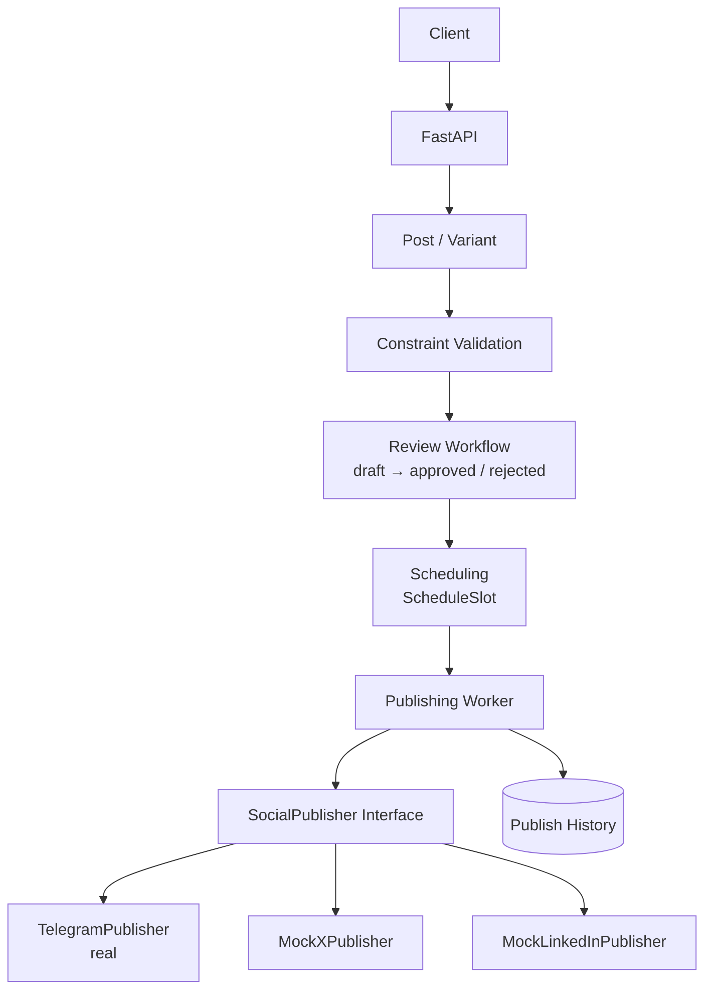
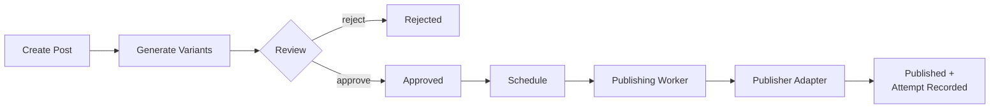

<div align="center">

# Social Media Studio

Turn one blog post into a reviewed, scheduled, multi-platform social campaign.

<p>
  
  
  
  
  
</p>

</div>

---

## About

Social Media Studio is a backend service built as the capstone for a backend
development internship. It takes a single blog post — a URL or pasted
Markdown — and turns it into platform-specific social media variants. Each
variant is reviewed and approved by a human before it can be scheduled. A background worker publishes approved variants at their scheduled time
and safely resumes after an interruption without republishing successfully
committed posts.

The project is built around one idea: **the publishing step must survive
retries and restarts without ever posting the same thing twice.**

## Contents

- [Features](#features)
- [Architecture](#architecture)
- [Project Structure](#project-structure)
- [Tech Stack](#tech-stack)
- [Setup](#setup)
- [Running the API](#running-the-api)
- [Running the Publishing Worker](#running-the-publishing-worker)
- [API Endpoints](#api-endpoints)
- [Basic Workflow](#basic-workflow)
- [Platform Constraints](#platform-constraints)
- [Publishing and Idempotency](#publishing-and-idempotency)
- [Publish History](#publish-history)
- [Testing](#testing)
- [Known Limitations](#known-limitations)
- [Documentation](#documentation)

## Features

- Create and store blog posts (URL or pasted content)
- Generate platform-specific social media variants from blog content
- Enforce per-platform content constraints (length, tone, hashtag limits)
- Review workflow: draft → approved / rejected → published
- Schedule approved variants, with safe rescheduling
- Publish through a common adapter interface
- Real publishing to Telegram; mock adapters for X and LinkedIn
- Record every publish attempt, success or failure
- Idempotent publishing — successfully completed publishes are not repeated
  after a worker retry or restart
- Resume safely after an interrupted worker run (see [EVIDENCE.md](EVIDENCE.md))
- Secrets kept in environment variables, never in source control

## Architecture



The worker selects a publisher based on the variant's `platform` field.
Swapping the target platform is a data change, not a code change — the
worker and the rest of the application never know which concrete adapter
they are talking to.

## Project Structure

```text
social-studio/
├── main.py            # FastAPI app and routes
├── database.py         # SQLAlchemy models and session
├── schemas.py          # Pydantic request models
├── constraints.py       # Platform constraint profiles and validation
├── publishers.py        # SocialPublisher interface and adapters
├── worker.py           # Standalone publishing worker
├── DESIGN.md           # Architecture and data model
├── EVIDENCE.md          # Real test evidence for each requirement
├── BUILDLOG.md          # Development log, decisions, AI usage
├── .env.example         # Environment variable template
├── .gitignore
├── requirements.txt
└── README.md
```

## Tech Stack

- Python
- FastAPI
- SQLAlchemy
- SQLite
- Pydantic
- Google Gemini API
- Telegram Bot API
- python-dotenv

## Setup

### 1. Clone the repository

```bash
git clone https://github.com/niraj-kumbhar-18/flyrank-capstone-social-studio.git

cd social-studio
```

### 2. Create a virtual environment

```bash
python -m venv .venv
```

Activate it on Windows:

```bash
.venv\Scripts\activate
```

### 3. Install dependencies

```bash
pip install -r requirements.txt
```

### 4. Configure environment variables

Copy `.env.example` to `.env` and fill in real values:

```text
TELEGRAM_BOT_TOKEN
TELEGRAM_CHAT_ID
GEMINI_API_KEY
```

Never commit `.env` or real API keys.

## Running the API

```bash
uvicorn main:app --reload
```

Interactive API docs (Swagger UI):

```text
http://127.0.0.1:8000/docs
```

## Running the Publishing Worker

```bash
python worker.py
```

The worker is a separate process from the API. Each run processes whatever
is currently due and then exits — it does not loop or stay running. Run it
again, or run it on a schedule (e.g. cron), to process newly due posts.

## API Endpoints

<details open>
<summary><strong>Posts</strong></summary>

| Method | Endpoint | Purpose |
|--------|----------|---------|
| POST | `/posts` | Create a post |
| GET | `/posts` | List posts |
| GET | `/posts/{post_id}` | Get a specific post |
| POST | `/posts/{post_id}/generate` | Generate social media variants |
| POST | `/posts/{post_id}/variants` | Create a variant manually |
| GET | `/posts/{post_id}/variants` | List variants for a post |

</details>

<details open>
<summary><strong>Variants</strong></summary>

| Method | Endpoint | Purpose |
|--------|----------|---------|
| GET | `/variants/{variant_id}` | Get a specific variant |
| POST | `/variants/{variant_id}/approve` | Approve a draft variant |
| POST | `/variants/{variant_id}/reject` | Reject a draft variant |
| POST | `/variants/{variant_id}/schedule` | Schedule an approved variant |

</details>

<details open>
<summary><strong>Publishing</strong></summary>

| Method | Endpoint | Purpose |
|--------|----------|---------|
| GET | `/publish-history` | View all publishing attempts |

</details>

## Basic Workflow



Only approved variants can be scheduled. The publishing worker processes
slots whose scheduled time has been reached.

## Platform Constraints

| Platform | Max Length | Tone | Max Hashtags |
|----------|-----------:|------|-------------:|
| Mock X | 280 | short, punchy | 2 |
| Mock LinkedIn | 3000 | professional | 3 |
| Telegram | 1024 | casual, informative | 3 |

Constraints are enforced in code (`constraints.py`) on both manually created
and AI-generated variants. A variant that breaks a rule is rejected before
it reaches review.

## Publishing and Idempotency

Each scheduled variant gets a stable idempotency key:

```text
variant-{variant_id}-schedule
```

The key is derived from the variant alone, independent of the scheduled
time, so rescheduling updates the existing slot instead of creating a
duplicate. Before publishing, the worker checks whether a successful
`PublishAttempt` already exists for that key — if so, it skips the slot.

This is what makes retries and worker restarts safe. The design went
through two earlier, broken versions before landing here — see
[BUILDLOG.md](BUILDLOG.md) for the full story, and
[EVIDENCE.md](EVIDENCE.md) for a real mid-batch interruption test proving
zero duplicate publishes.

## Publish History

Every publish attempt — success or failure — is recorded and viewable
through:

```text
GET /publish-history
```

Each record includes the attempt ID, schedule slot, variant, platform,
timestamp, success flag, detail message, and external post ID.

## Testing

All testing was manual, using Swagger UI, terminal commands, and direct
database inspection. Areas covered:

- Platform content constraint enforcement
- Review and approval workflow
- Scheduling restrictions
- Mock X and Telegram publishing
- Publishing failure recording
- Idempotent publishing
- Worker interruption and restart
- Publish history
- Git secret protection

Full real test output is documented in [EVIDENCE.md](EVIDENCE.md).

## Known Limitations

- Mock X and Mock LinkedIn are simulated and do not post to real platforms
- Telegram is the only real external publishing integration
- Uses SQLite for simplicity
- The publishing worker is run manually (`python worker.py`), not as a
  continuous daemon
- Platform validity is enforced at the API layer, not the database layer
- No authentication or multi-user support — this is a single-operator tool
- No analytics, engagement tracking, or image generation
- The worker restart test covers interruption between worker iterations,
  not interruption mid-HTTP-call to a publisher (see EVIDENCE.md)

## Documentation

- [DESIGN.md](DESIGN.md) — architecture, data model, and design decisions
- [EVIDENCE.md](EVIDENCE.md) — real test output for every requirement
- [BUILDLOG.md](BUILDLOG.md) — development log, debugging history, AI usage